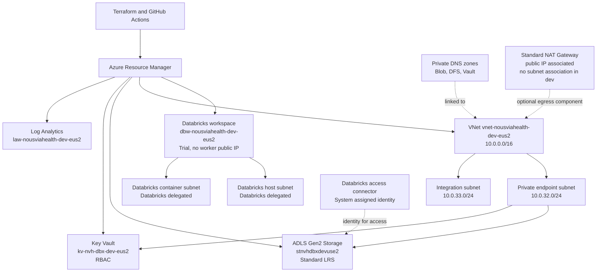

# 1. Purpose and Scope

This document describes the current Terraform implementation and Azure topology
for the NousviaHealth Databricks development environment. It covers:

- Databricks workspace placement and ownership.
- Virtual networking, delegated subnets, private endpoints, private DNS, and egress.
- Storage, Key Vault, monitoring, identity, and security boundaries.
- Connectivity flows, performance considerations, cost posture, and operations.
- Controls implemented today and controls required before production.

This is an adoption model for existing Azure resources. It is not an approval to
apply changes, import state, or promote the development configuration to production.

# 2. Scope and Assumptions

| Item | Current value |
|---|---|
| Subscription | `sub-nousviahealth-dev` |
| Subscription ID | `97ee3b56-2c25-44f9-a1bc-d603a09efc45` |
| Region | `eastus2` |
| Environment | Development |
| Terraform provider | AzureRM `~> 4.0` |
| Terraform version constraint | `>= 1.6.0` |
| Databricks SKU | `trial` |
| Storage replication | `Standard_LRS` |
| Availability target | Not supplied |
| RTO/RPO | Not supplied |
| Data classification | Databricks tags identify data as `Confidential`; formal classification is not supplied |
| Compliance requirements | Not supplied |
| Production region/DR region | Not supplied |

The Trial Databricks SKU and LRS storage are development choices. They are not
production availability or disaster-recovery commitments.

# 3. Architecture Summary

The Terraform root is composed in [main.tf](../main.tf). Environment values,
resource names, network ranges, and ownership flags are supplied in
`config/dev.tfvars`. The adoption import manifest is `imports.tf`.

# 4. Resource Inventory and Ownership

## 4.1 Resource groups

| Resource group | Role | Ownership |
|---|---|---|
| `rg-nousviahealth-network-dev-eus2` | VNet, subnets, NAT, public IP, private DNS, private endpoints, network NSG | Terraform adoption |
| `rg-nousviahealth-data-dev-eus2` | Storage, Key Vault, access connector, Blob private endpoint | Terraform adoption |
| `rg-nousviahealth-dbx-dev-eus2` | Databricks workspace and generated workspace NSG boundary | Workspace resource is Terraform-adopted; generated children are Databricks-owned |
| `rg-nousviahealth-monitor-dev-eus2` | Log Analytics workspace | Terraform adoption |
| `NetworkWatcherRG` | Azure Network Watcher | Azure-managed boundary, imported for inventory |
| `mrg-dbw-nousviahealth-dev-eus2` | Databricks-managed resources | Databricks-owned; not independently managed |

## 4.2 Databricks resources

| Resource | Current configuration | Ownership |
|---|---|---|
| Workspace | `dbw-nousviahealth-dev-eus2` | Terraform adopts the workspace resource |
| SKU | `trial` | Development-only |
| Location | `eastus2` | Terraform input/module configuration |
| Managed resource group | `mrg-dbw-nousviahealth-dev-eus2` | Databricks-owned |
| Worker public IP | Disabled with `no_public_ip = true` | Workspace configuration |
| VNet injection | Enabled through the existing VNet | Workspace configuration |
| Public network access | Enabled in supplied dev configuration | Development posture; production decision required |
| Network security rules | `AllRules` required | Databricks/workspace boundary |
| Infrastructure encryption | Disabled | Development posture; production decision required |
| Storage SKU for workspace-managed storage | `Standard_ZRS` | Databricks workspace parameter |

The following are deliberately excluded from independent Terraform ownership:

- Databricks-managed storage account and access connector resources.
- Databricks-managed user-assigned identity and Event Grid system topic.
- Databricks-generated NSG rules.
- Databricks delegated subnet address ranges and associations.
- Azure-generated private endpoint NICs and network intent policies.

The Databricks module has preconditions requiring a distinct managed resource
group and `generated_resource_ownership = "databricks"`.

## 4.3 Data and platform resources

| Resource | Current configuration | Security/connectivity |
|---|---|---|
| Storage `stnvhdbxdevuse2` | StorageV2, HNS enabled, Standard LRS, Hot, TLS 1.2 | Blob and DFS private endpoints; public access remains enabled in dev |
| Key Vault `kv-nvh-dbx-dev-eus2` | Standard, RBAC enabled, soft delete 90 days | Vault private endpoint; public access and no purge protection in dev |
| Access connector `ac-dbx-nousviahealth-dev-eus2` | System-assigned identity | Identity boundary for Databricks data access |
| Log Analytics `law-nousviahealth-dev-eus2` | PerGB2018, 30-day retention | Public ingestion/query enabled; diagnostic settings map is empty |

# 5. Network Architecture

## 5.1 VNet and subnet plan

VNet: `vnet-nousviahealth-dev-eus2`

Address space: `10.0.0.0/16`

| Subnet | Address space | Role | Terraform behavior |
|---|---|---|---|
| `snet-dbx-host-dev-eus2` | Azure-managed live range | Databricks host/public subnet | Read as a data source; Databricks owns delegation and association |
| `snet-dbx-container-dev-eus2` | Azure-managed live range | Databricks container/private subnet | Read as a data source; Databricks owns delegation and association |
| `snet-private-endpoints-dev-eus2` | `10.0.32.0/24` | Storage and Key Vault private endpoints | Terraform-managed; private endpoint network policies disabled |
| `snet-integration-dev-eus2` | `10.0.33.0/24` | Reserved integration workload subnet | Terraform-managed; no current workload association |

The explicitly managed subnets set `default_outbound_access_enabled = false`.
No route table, Azure Firewall, VPN, ExpressRoute, Bastion, or hub-spoke
peering is configured by this repository.

## 5.2 NSGs and egress

The customer-visible NSG `nsg-nousviahealth-dbx-dev-eus2` is adopted as
`platform_managed`. Terraform ignores its security rules and tags because the
live Databricks service owns the relevant network controls.

The Databricks-generated NSG contains service-required rules for:

- Worker-to-worker traffic within the VNet.
- Databricks control-plane ports TCP `443`, `3306`, and `8443-8451`.
- Azure SQL TCP `3306`.
- Azure Storage TCP `443`.
- Event Hubs TCP `9093`.

A Standard NAT Gateway named `rg-nousviahealth-network-dev-eus2` and a Standard
zonal public IP are adopted. The public IP is associated with the NAT Gateway,
but `nat_gateway_subnet_name = null`, so no subnet uses the NAT Gateway in the
current dev configuration. Attaching it requires an explicit target subnet and
ownership decision.

# 6. Private Connectivity and DNS

## 6.1 Private endpoints

| Endpoint | Location | Target subresource | Private IP observed |
|---|---|---|---|
| `pep-stnvhdbxdev-blob-eus2` | Data resource group | Storage `blob` | `10.0.32.5` |
| `pep-stnvhdbxdev-dfs-eus2` | Network resource group | Storage `dfs` | `10.0.32.4` |
| `pep-kv-nvh-dbx-dev-eus2` | Network resource group | Key Vault `vault` | `10.0.32.6` |

All endpoints use `snet-private-endpoints-dev-eus2`. Existing private service
connection names and generated NIC names are preserved to avoid replacement
during adoption.

## 6.2 Private DNS zones

| Zone | VNet link | Purpose |
|---|---|---|
| `privatelink.blob.core.windows.net` | `link-nousviahealth-dev-eus2` | Blob endpoint resolution |
| `privatelink.dfs.core.windows.net` | `vnet-nousviahealth-dev-eus2` | ADLS Gen2 DFS endpoint resolution |
| `privatelink.vaultcore.azure.net` | `vnet-nousviahealth-dev-eus2` | Key Vault endpoint resolution |

All links have registration disabled. Azure creates the private endpoint A
records through the endpoint DNS zone groups. DNS forwarding for peered VNets,
hub networks, on-premises clients, or other subscriptions is not implemented.

Production acceptance requires a tested DNS design for every client network.

# 7. Connectivity Matrix

| Source | Destination | Protocol/port | Direction | Implemented control |
|---|---|---|---|---|
| Databricks host/container subnets | Databricks control plane | TCP `443`, `3306`, `8443-8451` | Outbound | Databricks-generated NSG |
| Databricks host/container subnets | Azure SQL | TCP `3306` | Outbound | Databricks-generated NSG |
| Databricks host/container subnets | Storage | TCP `443` | Outbound | Databricks-generated NSG, private endpoints where applicable |
| Databricks host/container subnets | Event Hubs | TCP `9093` | Outbound | Databricks-generated NSG |
| VNet clients | Storage Blob | HTTPS `443` | Outbound | Blob private endpoint and private DNS |
| VNet clients | Storage DFS | HTTPS `443` | Outbound | DFS private endpoint and private DNS |
| VNet clients | Key Vault | HTTPS `443` | Outbound | Key Vault private endpoint and private DNS |
| VNet clients | Private DNS resolution | TCP/UDP `53` | Outbound | Azure VNet DNS and linked zones |
| Terraform identity | Azure Resource Manager | HTTPS `443` | Outbound | Entra/OIDC and scoped RBAC |

The actual Databricks control-plane connectivity requirements must be validated
against the selected Azure Databricks region, workspace network configuration,
and any future secure-cluster-connectivity or Private Link design.

# 8. Security Architecture

## 8.1 Identity and access

- Terraform is intended to authenticate with GitHub OIDC and Azure Entra ID.
- No client secrets, storage keys, connection strings, or Key Vault secret
  values are represented in Terraform configuration.
- The access connector uses a system-assigned identity.
- Key Vault uses Azure RBAC and no access-policy entries.
- Databricks-generated managed identities remain Databricks-owned.
- Resource-level RBAC assignments are not currently declared in this root.

Production must document the deployment identity, Databricks access connector
roles, Storage data-plane roles, Key Vault roles, break-glass access, PIM/PAM,
and separation between plan, import, and apply identities.

## 8.2 Public access and encryption posture

The supplied dev configuration intentionally preserves the live state:

- Storage public network access: enabled.
- Storage shared-key access: enabled.
- Storage anonymous nested-item access: disabled.
- Storage minimum TLS: TLS 1.2.
- Key Vault public network access: enabled.
- Key Vault RBAC: enabled.
- Key Vault soft delete: enabled for 90 days.
- Key Vault purge protection: disabled in dev.
- Log Analytics ingestion/query public access: enabled.
- Databricks public network access: enabled.
- Databricks worker public IPs: disabled.
- Databricks infrastructure encryption: disabled.

Private endpoints do not disable public access by themselves. Production must
use explicit no-public-access settings where compatible, validate private DNS,
enable Key Vault purge protection, and document any approved exceptions.

## 8.3 Data protection

The current Storage account is HNS-enabled ADLS Gen2 with Standard LRS. There
is no declared backup vault, customer-managed key, cross-region replication,
immutability policy, or storage lifecycle policy in this repository.

Production requirements:

- Entra/RBAC data access and shared-key disablement where all clients support it.
- ZRS, GZRS, or an approved alternative based on RTO/RPO.
- Key rotation and customer-managed key decision.
- Storage soft delete, versioning, change feed, and lifecycle requirements.
- Databricks Unity Catalog governance and external location ownership.

# 9. Performance and Scalability

## 9.1 Current capacity posture

- Databricks SKU is Trial; cluster sizing, autoscaling, pools, policies, and
  concurrency limits are not managed by this repository.
- Storage is Standard LRS with Hot access tier.
- Log Analytics uses PerGB2018 with 30-day retention and no daily cap.
- The VNet uses a `/16`, with `/24` private endpoint and integration subnets.
- Private endpoint capacity is currently sufficient for the three observed endpoints.

## 9.2 Performance considerations

- Keep Databricks worker traffic on the injected VNet and avoid unnecessary
  public data paths.
- Use private endpoints and local private DNS to reduce unpredictable public
  path latency for Storage and Key Vault.
- Monitor Storage throttling, request latency, ingress/egress, and private
  endpoint connection health.
- Monitor Databricks cluster startup time, DBU consumption, executor pressure,
  shuffle, job duration, and control-plane availability.
- Monitor Log Analytics ingestion volume and query duration; define a daily cap
  and retention policy after workload baselines are known.
- Validate subnet IP capacity before adding clusters, private endpoints, or
  additional integration services.

## 9.3 Required performance decisions

Before production, define expected users, concurrent clusters, peak jobs,
storage throughput, data volume growth, private endpoint count, Log Analytics
ingestion rate, and monthly cost budget. These inputs determine Databricks
cluster policies, SKU selection, subnet sizing, storage replication, and
monitoring caps.

# 10. Observability and Operations

The Log Analytics workspace exists with 30-day retention. The Terraform
diagnostic-settings map is currently empty because live categories, target
resource IDs, and retention requirements were not supplied.

Production observability must add reviewed diagnostic settings for at least:

- Databricks workspace control-plane activity.
- Storage read/write/delete, authorization, and capacity signals.
- Key Vault audit events and denied operations.
- Private endpoint and network connectivity failures.
- NAT gateway and public IP health where the NAT path is used.
- Azure Activity Log and policy/compliance events.

Required operational artifacts include:

- Alert rules and action groups with named owners.
- Incident response for private DNS, private endpoint, Databricks, Storage,
  and Key Vault failures.
- Backup and restore procedures.
- Databricks workspace recovery and managed-resource ownership procedure.
- Terraform state recovery, import, rollback, and drift procedures.

# 11. Availability, Recovery, and Cost

Current dev choices are cost-focused and single-region:

- Databricks Trial SKU.
- Storage Standard LRS.
- PerGB2018 Log Analytics with 30-day retention.
- Standard NAT Gateway and Standard public IP.

These settings do not establish production availability. Before production,
approve:

- Availability zones and regional disaster recovery.
- Databricks workspace recovery and data-plane recovery.
- Storage replication and backup strategy.
- Key Vault recovery and purge-protection policy.
- RTO/RPO and recovery-test frequency.
- Budget, DBU controls, cluster auto-termination, storage lifecycle, and Log
  Analytics ingestion limits.

# 12. Terraform Ownership and Change Safety

Terraform adopts the customer resource groups, VNet, explicitly addressed
subnets, private DNS zones and links, NAT Gateway/public IP association,
Storage, Key Vault, Log Analytics, access connector, Databricks workspace,
private endpoints, and Network Watcher.

Terraform does not independently manage Databricks-managed children, generated
private endpoint NICs, network intent policies, Key Vault secrets, or storage
child data that was not inventoried.

Before any apply:

1. Configure and verify the environment-specific remote backend.
2. Confirm the subscription, tenant, GitHub Environment, and OIDC trust.
3. Review all import blocks and execute adoption only through an approved process.
4. Run an authenticated plan using the intended state key and `config/dev.tfvars`.
5. Reject any unexpected create, destroy, replacement, public-access change,
   RBAC change, tag removal, subnet association, or Databricks child change.
6. Store plans and state only in approved protected locations.

# 13. Readiness Checklist

## Implemented in current dev code

- [x] VNet-injected Databricks workspace.
- [x] Databricks worker public IP disabled.
- [x] Dedicated private endpoint subnet.
- [x] Storage Blob and DFS private endpoints.
- [x] Key Vault private endpoint.
- [x] Private DNS zones and VNet links.
- [x] Databricks generated-resource ownership boundary.
- [x] Terraform import manifest for live adoption.
- [x] Resource-group `prevent_destroy` safeguard.

## Required before production approval

- [ ] Remove unnecessary public network access.
- [ ] Enable and verify Key Vault purge protection.
- [ ] Approve Storage Entra/RBAC and shared-key posture.
- [ ] Select replication and backup based on RTO/RPO.
- [ ] Define Databricks Unity Catalog, cluster policies, secret scopes, and egress controls.
- [ ] Define diagnostic settings, alerts, Defender, Policy, and log retention.
- [ ] Confirm DNS resolution from every client network.
- [ ] Confirm NSG, route, firewall, and egress ownership.
- [ ] Test recovery and rollback procedures.
- [ ] Run a reviewed plan with zero unexpected creates or destroys.

# 14. References

- [Current networking design](networking.md)
- [Live dev adoption notes](adoption.md)
- [Terraform CI/CD design](terraform-cicd.md)
- [Terraform root](../main.tf)
- [Dev environment configuration](../config/dev.tfvars)