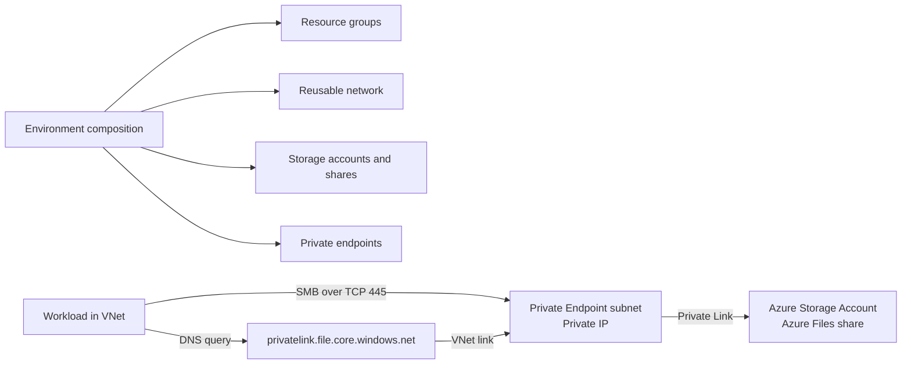

# Executive Summary

This design provisions one or more Azure Storage Accounts and Azure Files shares reachable through Private Endpoints in reusable dedicated VNet subnets. Public network access is disabled, one shared private DNS zone is owned by each network, and an NSG limits each private endpoint subnet to Azure Virtual Network traffic. The Terraform root is an environment composition boundary using keyed maps, with explicit resource-group ownership for each resource family.

## Scope

Included:

- Resource group.
- VNet and dedicated private endpoint subnet.
- NSG associated with the private endpoint subnet.
- Storage Account and Azure Files share.
- Storage private endpoint for the `file` subresource.
- Private DNS zone, VNet link, and private DNS zone group.

Excluded until requirements are confirmed:

- Hub-and-spoke or hybrid connectivity to on-premises networks.
- Azure Firewall, VPN/ExpressRoute, Bastion, and centralized egress.
- Entra Kerberos, Azure AD Domain Services, or Windows identity-based SMB authorization.
- Backup vault, cross-region replication, customer-managed keys, and diagnostic workspace.

# Requirements and Assumptions

| Category | Requirement or assumption | State |
|---|---|---|
| Workload | Azure Files share accessed by workloads connected to the VNet | Assumption |
| Network | Private Endpoint is the only intended data-plane path | Explicit design decision |
| Exposure | Storage public network access is disabled | Security default |
| Addressing | Default VNet is `10.20.0.0/16`; private endpoint subnet is `10.20.1.0/24`; subnets must be contained and non-overlapping | Configurable assumption |
| Region | `eastus` default; must be confirmed for production | Configurable assumption |
| Storage | Standard locally redundant StorageV2 account by default | Configurable assumption |
| Share | 100 GiB default quota; adjust for workload and cost | Configurable assumption |
| Identity | Terraform uses the authenticated Azure identity; no credentials are stored in code | Constraint |
| State | Production state should use an Azure Storage backend with locking | Operational requirement |
| Resilience | Single-region baseline; zone/region DR is not claimed by this design | Open decision |
| Ownership | Owner, cost center, and data classification are supplied through tags; resource group keys are explicit | Required input |

Production decisions still required: subscription and resource group ownership boundary, region pair, RTO/RPO, expected throughput and capacity, client operating systems, SMB/NFS protocol needs, compliance classification, backup retention, and whether identity-based authorization is mandatory.

# Architecture



## Resource Inventory

| Resource | Terraform resource | Purpose | Network exposure |
|---|---|---|---|
| Resource group | `azurerm_resource_group` | Lifecycle boundary | Azure control plane |
| VNet | `azurerm_virtual_network` | Private address space | No public ingress |
| Private endpoint subnet | `azurerm_subnet` | Hosts the storage private endpoint | Private only |
| NSG | `azurerm_network_security_group` | Subnet traffic baseline | Allows VNet traffic; denies other inbound traffic |
| Storage account | `azurerm_storage_account` | Azure Files data service | Public access disabled |
| File share | `azurerm_storage_share` | Shared file data | Via private endpoint |
| Private endpoint | `azurerm_private_endpoint` | Private Link connection to Files | Private IP in VNet |
| Private DNS zone | `azurerm_private_dns_zone` | Resolves Files FQDN to private IP | One shared zone per network, VNet linked |
| DNS zone group | `azurerm_private_dns_zone_group` | Associates endpoint and DNS zone | Private Link |

## Network Plan

| Element | CIDR or value | Intent |
|---|---|---|
| VNet | `10.20.0.0/16` | Address space; configurable |
| Private endpoint subnet | `10.20.1.0/24` | Dedicated subnet for Private Endpoints |
| Private DNS zone | `privatelink.file.core.windows.net` | Azure Files Private Link name resolution; unique per resource group in this implementation |
| Protocol | TCP 445 | SMB client access; enforce client-side egress policy as needed |

The subnet sets `private_endpoint_network_policies = "Disabled"`, which is required for Private Endpoint network interface behavior. The NSG allows traffic originating within the VNet and denies other inbound traffic. Multiple endpoints can use the same network and DNS zone. A broader workload subnet and route design must be added when this baseline is integrated into an existing hub-and-spoke network.

## Communication Matrix

| Source | Destination | Protocol/port | Direction | Trust boundary | Control |
|---|---|---|---|---|---|
| VNet workload | Storage private endpoint | SMB/TCP 445 | Outbound | Workload to private data plane | NSG, private endpoint, storage public access disabled |
| VNet workload | Private DNS zone | DNS TCP/UDP 53 | Outbound | Workload to platform DNS | Azure VNet DNS and linked private zone |
| Terraform identity | Azure Resource Manager | HTTPS/443 | Outbound | Deployment control plane | Entra authentication and least-privilege RBAC |

# Security Model

- Authenticate Terraform with Azure CLI, workload identity federation, or managed identity. Never place client secrets, storage keys, or connection strings in Terraform or committed variable files.
- Disable storage public network access and require HTTPS/TLS 1.2.
- Disable anonymous nested-item public access. Shared Key remains enabled for Terraform's Azure Files data-plane operations; restrict key access through RBAC and never expose account keys in workflow output. Before client onboarding, configure Entra-based Azure Files authorization for SMB users or workloads where supported.
- Use RBAC for deployment and data access. Scope roles to the resource group or individual storage account; avoid subscription-wide Owner assignments.
- Keep `*.tfvars`, state, plans, and generated credentials out of source control. Use remote state with locking for shared environments.
- Add Azure Policy, Defender for Storage, diagnostic settings, and Key Vault integration as platform requirements for production.

# Reliability, Operations, and Cost

- The default Standard LRS account is a cost-conscious baseline, not a disaster recovery guarantee. Select ZRS/GRS/GZRS after RTO/RPO and region requirements are known.
- Set share quota from measured capacity and growth; monitor used capacity and transaction metrics.
- Configure diagnostic settings to Log Analytics and alerts for availability, capacity, authorization failures, and throttling before production use.
- A private endpoint incurs networking cost; it is retained because the design prioritizes reduced public exposure and controlled access.
- Recovery procedures must include Terraform state recovery, storage data protection/backup, and private DNS validation.

# Terraform Implementation

The root Terraform composition and module folders in this repository implement this document:

- `versions.tf`: AzureRM provider and Terraform constraints.
- `variables.tf`: validated legacy inputs and keyed environment composition maps.
- `locals.tf`: compatibility translation from singular inputs to keyed maps.
- `main.tf`: root composition, cross-reference checks, and state address moves.
- `modules/resource-group/`: resource group module.
- `modules/network/`: VNet, private endpoint subnet, NSG, and subnet association module.
- `modules/storage/`: storage account and Azure Files share module.
- `modules/private-endpoint/`: private endpoint and DNS zone group module; the zone itself is network-owned and shared.
- `outputs.tf`: compatibility outputs plus keyed resource group, network, subnet, storage account, share URL, and endpoint IDs/IPs. Singular compatibility share output selects the first logical share by sorted key.
- `config/<environment>.tfvars.example`: safe environment configuration templates; copy one to an ignored `.tfvars` file and review before use.

Validation workflow:

```text
terraform fmt -check
terraform init -backend=false
terraform validate
terraform plan -out=tfplan
```

Use `-var-file=config/<environment>.tfvars` for every environment. Each environment should use an isolated remote-state key and its own plan/approval boundary. Adding a resource changes only the relevant map entry; adding a new map key creates a new Terraform instance address.

Review the plan for public exposure, replacement, address changes, RBAC impact, and data loss before any apply. `terraform apply` requires explicit approval and an authenticated Azure subscription context.
