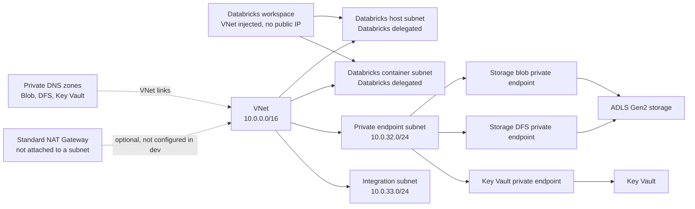

# Overview

This document describes the Terraform-managed networking topology for the
NousviaHealth development environment in `eastus2`. The configuration adopts
existing Azure resources; it is not a greenfield network deployment.

Subscription: `sub-nousviahealth-dev`

Virtual network: `vnet-nousviahealth-dev-eus2`

Address space: `10.0.0.0/16`

Network resource group: `rg-nousviahealth-network-dev-eus2`

The live environment uses customer-managed private endpoints and private DNS
for Storage and Key Vault. Databricks owns its generated NSG rules, delegated
subnet ranges, managed resource group, private endpoint NICs, and network intent
policies. Terraform reads those Databricks-managed dependencies but does not
independently manage them.

# Network Topology

# Subnets

| Subnet | Addressing | Terraform ownership | Purpose |
|---|---|---|---|
| `snet-private-endpoints-dev-eus2` | `10.0.32.0/24` | Terraform | Hosts Storage and Key Vault private endpoints. Private endpoint network policies are disabled. |
| `snet-integration-dev-eus2` | `10.0.33.0/24` | Terraform | Reserved integration subnet. Private endpoint network policies are disabled. |
| `snet-dbx-host-dev-eus2` | Azure-managed live range | Databricks | Delegated to `Microsoft.Databricks/workspaces`; associated with the Databricks-generated NSG. |
| `snet-dbx-container-dev-eus2` | Azure-managed live range | Databricks | Delegated to `Microsoft.Databricks/workspaces`; associated with the Databricks-generated NSG. |

The Terraform network module manages the VNet and the two explicitly addressed
subnets. It reads the Databricks delegated subnets as data sources so their
platform-managed address ranges and associations are not overwritten.

All Terraform-managed subnets set `default_outbound_access_enabled = false`.
The live configuration does not set `nat_gateway_subnet_name`, so Terraform
does not attach the NAT Gateway to any subnet.

# Network Resources

| Resource | Name | Terraform behavior |
|---|---|---|
| Virtual network | `vnet-nousviahealth-dev-eus2` | Imported and managed |
| Network security group | `nsg-nousviahealth-dbx-dev-eus2` | Imported; marked `platform_managed`; rules and tags ignored |
| NAT Gateway | `rg-nousviahealth-network-dev-eus2` | Imported; Standard SKU, zone `1`, four-minute idle timeout |
| Public IP | `pip-nousviahealth-nat-dev-eus2` | Imported; Standard Regional, static IPv4, zones `1`, `2`, `3` |
| NAT/Public IP association | Existing association | Imported |
| NAT/subnet association | None in dev | Optional Terraform input, currently `null` |
| Network Watcher | `NetworkWatcher_eastus2` | Imported in `NetworkWatcherRG` |

The Databricks-generated NSG `databricksnsgwtzfq4y2p7vjy` is outside the
Terraform ownership boundary. Its required rules allow Databricks worker
communication and outbound access to Azure Databricks, SQL, Storage, and
Event Hubs. Terraform must not replace those rules or subnet associations.

# Private DNS

The network resource group owns and links these zones to the VNet:

| Zone | Link name | Used by |
|---|---|---|
| `privatelink.blob.core.windows.net` | `link-nousviahealth-dev-eus2` | Storage Blob private endpoint |
| `privatelink.dfs.core.windows.net` | `vnet-nousviahealth-dev-eus2` | ADLS Gen2 DFS private endpoint |
| `privatelink.vaultcore.azure.net` | `vnet-nousviahealth-dev-eus2` | Key Vault private endpoint |

All links have registration disabled. Azure-managed A records are created by
the private endpoint DNS zone groups and are not declared as standalone
Terraform records.

DNS forwarding from hub, peered, on-premises, or other client networks is not
configured by this repository. Any consumer outside this VNet requires an
approved DNS forwarding or Private Resolver design.

# Private Endpoints

All endpoints use `snet-private-endpoints-dev-eus2` and are approved in Azure.

| Endpoint | Resource group | Target | Group |
|---|---|---|---|
| `pep-stnvhdbxdev-blob-eus2` | `rg-nousviahealth-data-dev-eus2` | `stnvhdbxdevuse2` | `blob` |
| `pep-stnvhdbxdev-dfs-eus2` | `rg-nousviahealth-network-dev-eus2` | `stnvhdbxdevuse2` | `dfs` |
| `pep-kv-nvh-dbx-dev-eus2` | `rg-nousviahealth-network-dev-eus2` | `kv-nvh-dbx-dev-eus2` | `vault` |

Terraform preserves the existing private service connection names and
Azure-generated NIC names. The NICs are platform-generated children and are
not declared as independent Terraform resources.

# Communication Matrix

| Source | Destination | Protocol/port | Direction | Control |
|---|---|---|---|---|
| Databricks host/container subnets | Azure Databricks control plane | TCP `443`, `3306`, `8443-8451` | Outbound | Databricks-generated NSG |
| Databricks host/container subnets | Azure Storage | TCP `443` | Outbound | Databricks-generated NSG and private endpoints where applicable |
| Databricks host/container subnets | Azure SQL | TCP `3306` | Outbound | Databricks-generated NSG |
| Databricks host/container subnets | Event Hubs | TCP `9093` | Outbound | Databricks-generated NSG |
| VNet clients | Storage Blob private endpoint | HTTPS `443` | Outbound | Private endpoint and Blob private DNS |
| VNet clients | Storage DFS private endpoint | HTTPS `443` | Outbound | Private endpoint and DFS private DNS |
| VNet clients | Key Vault private endpoint | HTTPS `443` | Outbound | Private endpoint and Key Vault private DNS |
| VNet clients | Azure DNS/private DNS resolution | DNS TCP/UDP `53` | Outbound | Azure VNet DNS and linked private zones |
| Terraform identity | Azure Resource Manager | HTTPS `443` | Outbound | Entra authentication and scoped RBAC |

This repository does not create a firewall, route table, VPN, ExpressRoute,
Bastion, hub-spoke peering, or centralized egress path.

# Security Posture

The supplied dev configuration intentionally preserves the live posture:

- Storage public network access is enabled.
- Storage shared-key access is enabled.
- Key Vault public network access is enabled.
- Key Vault uses RBAC, 90-day soft delete, and no purge protection.
- Log Analytics ingestion and query public access are enabled.
- Databricks public network access is enabled, while worker nodes use no public IP.
- Storage uses Standard LRS.
- Databricks uses the Trial SKU.

Private endpoints provide private data-plane paths but do not disable public
access. Production requires an approved hardening plan covering private DNS,
Databricks control-plane connectivity, Entra/RBAC access, storage replication,
Key Vault purge protection, diagnostic settings, and client dependencies.

# Terraform Ownership

The root composition is in `main.tf`; live values and resource names are in
`config/dev.tfvars`. The import manifest is `imports.tf`.

Terraform manages or adopts:

- Customer resource groups and Network Watcher resource group boundary.
- VNet, explicitly addressed subnets, NAT Gateway, public IP, NAT/IP association,
  private DNS zones, DNS links, NSG shell, Storage, Key Vault, Log Analytics,
  access connector, Databricks workspace, and private endpoints.

Terraform deliberately does not independently manage:

- Databricks managed resource group children.
- Databricks-generated NSG rules and delegated subnet ranges.
- Private endpoint NICs.
- Azure network intent policies.
- Key Vault secrets or storage child data not retrieved during inventory.

Run `terraform plan` only after configuring the approved remote backend and
review every replacement, public-access change, tag change, RBAC change, and
network association before approval.